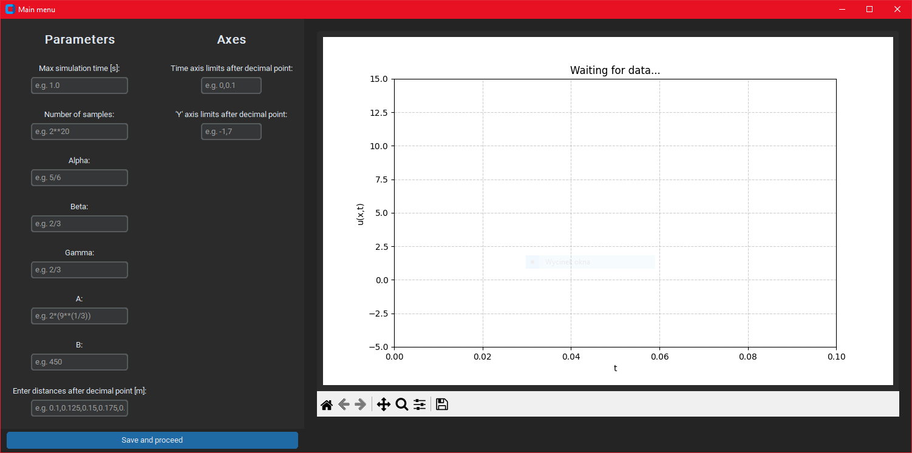
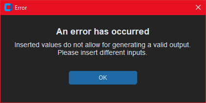

# Narzędzie do wizualizacji propagacji fal w liniach transmisyjnych opisanych modelami matematycznymi niecałkowitego rzędu w Pythonie
Aplikacja stworzona na rzecz dyplomu inżynierskiego Mateusza Gościnieckiego.

## Spis treści
- [Główne informacje](#główne-informacje)
- [Użyte technologie](#użyte-technologie)
- [Konfiguracja](#konfiguracja)
- [Opis kodu i aplikacji](#opis-kodu-i-aplikacji)

## Główne informacje
Program ten został napisany na podstawie pracy inżynierskiej pt. 
"Narzędzie do wizualizacji propagacji fal w liniach transmisyjnych opisanych modelami matematycznymi niecałkowitego rzędu".
Aplikacja adaptuje treść obliczeniową dyplomu do programu w Pythonie. Parametry wprowadzane są przy pomocy GUI,
a wizualizacja fal odbywa się przy pomocy wykresu. Program ma wbudowaną obsługę błędów.

## Użyte technologie
Część matematyczna została opisana w pracy inżynierskiej. Wszystkie zewnętrzne biblioteki użyte w projekcie
zawarte są w pliku "requirements.txt".
Customtkinter odpowiada za wygląd całości GUI.  
Numpy, Scipy używane są w części obliczeniowej programu (np. scipy.fft albo scipy.ifft).  
Matplotlib odpowiedzialne jest za generowanie wykresów.  
Pozostałe biblioteki obecne w pliku "requirements.txt" zostały dodane, gdyż powyższe ich wymagały.

## Konfiguracja
W celu poprawnego działania programu należy najpierw pobrać wymagane biblioteki zawarte w pliku "requirements.txt".
Plik odpowiedzialny za prawidłowe odpalenie aplikacji to "main.py"

## Opis kodu i aplikacji

### [main.py](Scripts_and_necessary_files/main.py)
Główny skrypt aplikacji. Po jego uruchomieniu, pojawia się następujące okno:

  

Lewa strona służy do wprowadzania parametrów modelu, symulacji oraz początkowych granic osi wykresu.
Znajduje się tu też guzik "Save and proceed", służący do uruchamiania symulacji. Po prawej stronie
znajduje się okno wykresu odpowiedzialne za wizualizację propagacji fal. W kodzie, okno główne zrealizowane jest
przy pomocy jednej klasy "App". Klasa ta zawiera 4 funkcje. Funkcje "first_panel_init", "second_panel_init"
oraz "figure_panel_init" służą do inicjalizowania poszczególnych głównych części okna 
(odpowiednio części z parametrami modelu, z parametrami osi oraz z wykresem). Parametry
mogą być wprowadzane w formie liczbowej albo w formie wyrażenia, które korzysta z wbudowanych
operatorów w Pythonie, z funkcji zawartych w bibliotece Numpy lub z funkcji zawartych w bibliotece Math. 
Ostatnia funkcja "save_button" wywoływana jest przez przycisk "Save and proceed". 
Zbiera ona dane z wprowadzonych wartości i przekazuje je do części programu, gdzie jest obliczana odpowiedź
układu. Następnie na podstawie otrzymanych danych generuje ona wykres napięcia od czasu dla wszystkich wartości "x".
Funckja ta odpowiedzialna jest też za obsługę błędów.

### [output_signal.py](Scripts_and_necessary_files/output_signal.py)
Skrypt ten zawiera funkcję "output_signal" ta przyjmuje parametry modelu i symulacji oraz sygnał wejściowy. Następnie
przy pomocy transformacji Fouriera i Hilberta oblicza ona odpowiedź linii transmisyjnej
na zadane pobudzenie. Szczegółowy opis zachodzących tu obliczeń został przedstawiony we wspomnianej wcześniej
pracy dyplomowej. Funkcja zwraca wartość w postaci listy próbek czasu oraz odpowiadającym im wartościom napięcia.

### [input_signal.py](Scripts_and_necessary_files/input_signal.py)
Skrypt z funkcją "input_signal", która dla zadanej liczby próbek oraz czasu symulacji 
generuje sygnał delty Kroneckera.

### [error_window.py](Scripts_and_necessary_files/error_window.py)
Skrypt z klasą "ErrorPopup" odpowiedzialną za okno informującego o wystąpieniu błędu.

  

Okno wyświetla się nad głównym oknem programu i blokuje możliwość korzystania z niego. 
W oknie błędu wyświetlana jest zadana informacja i w skrajnych przypadkach ma ono możliwość zakończenia działania całej
aplikacji.